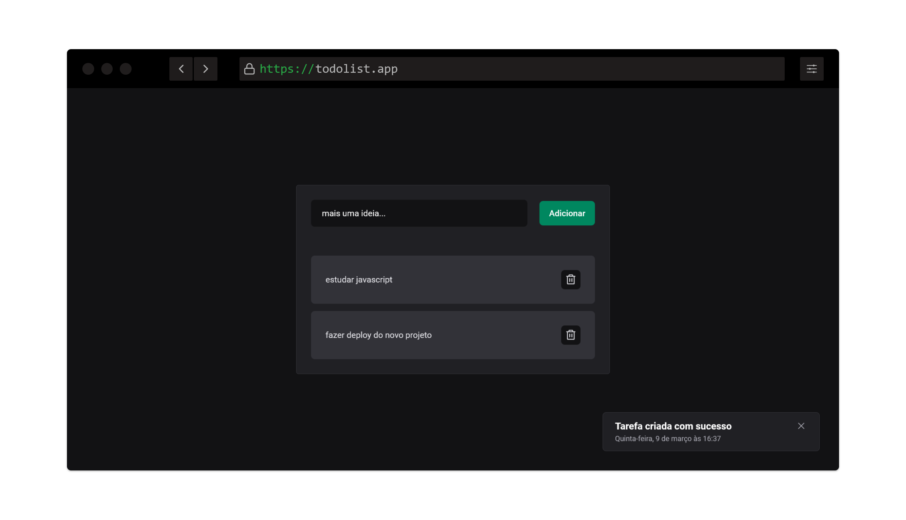

#  Youtube Projects

Nesso repositório você vai encontrar vários projetos desenvolvidos através de conteúdos no youtube.

## Projeto 01 - Todo List

Esse projeto foi desenvolvido usando:

- HTML
- CSS
- Javascript

Durante o desenvolvimento você pode aprender a manipular a DOM, trabalhar com arrays e objetos, integração com o LocalStorage para salvar os dados no navegador do usuário.

Para aprender a desenvolver esse projeto indico o vídeo do canal [dicasparadevs](https://www.youtube.com/watch?v=0bNeKAzVvlE)

