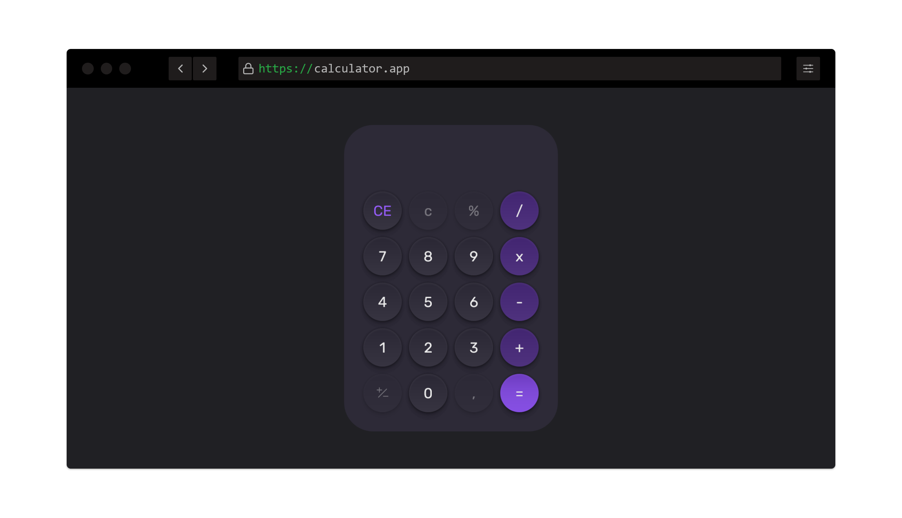

# Youtube Projects

Nesso repositório você vai encontrar vários projetos desenvolvidos através de conteúdos no youtube.

## Projeto 01 - Todo List

Esse projeto foi desenvolvido usando:

- HTML
- CSS
- Javascript

Durante o desenvolvimento você pode aprender a manipular a DOM, trabalhar com arrays e objetos, integração com o LocalStorage para salvar os dados no navegador do usuário.

Para aprender a desenvolver esse projeto indico o vídeo do canal [dicasparadevs](https://www.youtube.com/watch?v=0bNeKAzVvlE)

## Projeto 02 - Calculator

Esse projeto foi desenvolvido usando:

- HTML
- CSS
- Javascript
- Phosphor icon CDN

Durante o desenvolvimento você pode aprender a manipular a DOM e trabalhar com operações matemáticas.

O layout foi baseado em um projeto da Rocketseat chamado _BoraCodar_, você pode acessar o figma por [aqui](<https://www.figma.com/file/S04oYiyzJ5vdRatS5VTaMc/%23boraCodar---Desafio-5-(Community)?node-id=0%3A1&t=Ti9Z97EZl6dUx6qd-1>)

Para aprender a desenvolver esse projeto indico o vídeo do canal [dicasparadevs](https://youtu.be/93wPYo1pjic)

